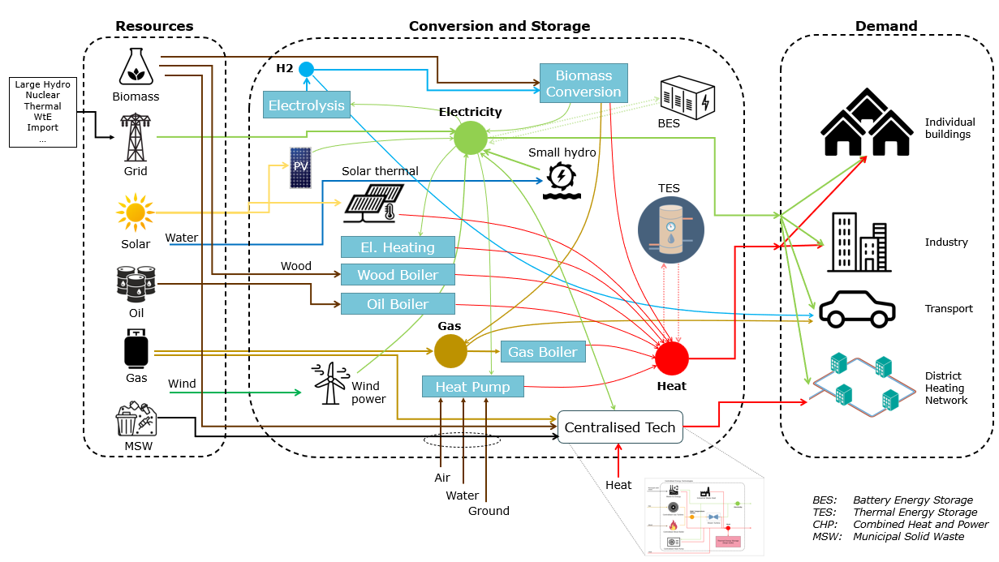

# District Energy Model (DEM)

Multi-energy system model for mixed-use districts and communities developped in the framework of the [SWEET EDGE](https://www.sweet-edge.ch/en/work-packages/wp-1) project.




## Directory structure
```
District_Energy_Model/
├───config/
|   ├───...
|   └───...
├───data/
|   ├───biomass_data/
|   ├───community_data/
|   ├───electricity_demand/
|   ├───electricity_mix_CH/
|   ├───heat_demand/
|   ├───master_data/
|   ├───pv_data/
|   └───...
├───doc/
|   ├───DEM_00_model_structure.pptx
|   ├───DEM_calliope_coupling.pptx
|   ├───DEM_demand_electricity.pptx
|   ├───DEM_demand_heat.pptx
|   ├───DEM_electricity_mix.pptx
|   ├───DEM_scenarios.pptx
|   ├───District_energy_model_input.xlsx
|   ├───District_energy_model_output.xlsx
|   ├───District_energy_model_schematic.pptx
|   └───...
└───src/
|   ├───techs/
|   |   ├───dem_tech_battery_energy_storage.py
|   |   ├───dem_tech_biomass.py
|   |   ├───dem_tech_chp_gt.py
|   |   ├───dem_tech_core.py
|   |   ├───dem_tech_district_heating.py
|   |   ├───dem_tech_electric_heater.py
|   |   ├───dem_tech_gas_boiler.py
|   |   ├───dem_tech_gas_turbine_cp.py
|   |   ├───dem_tech_grid_supply.py
|   |   ├───dem_tech_heat_exchanger.py
|   |   ├───dem_tech_heat_pump.py
|   |   ├───dem_tech_hydro_power.py
|   |   ├───dem_tech_hydrogen.py
|   |   ├───dem_tech_oil_boiler.py
|   |   ├───dem_tech_other.py
|   |   ├───dem_tech_solar_pv.py
|   |   ├───dem_tech_solar_thermal.py
|   |   ├───dem_tech_steam_turbine.py
|   |   ├───dem_tech_thermal_energy_storage.py
|   |   ├───dem_tech_waste_to_energy.py
|   |   ├───dem_tech_wind_power.py
|   |   ├───dem_tech_wood_boiler.py
|   |   └───dem_tech_wood_boiler_sg.py
|   ├───dem.py
|   ├───dem_calliope.py
|   ├───dem_calliope_clustering.py
|   ├───dem_clustering.py
|   ├───dem_constants.py
|   ├───dem_costs.py
|   ├───dem_demand.py
|   ├───dem_emissions.py
|   ├───dem_energy_balance.py
|   ├───dem_helper.py
|   ├───dem_output.py
|   ├───dem_scenarios.py
|   ├───dem_supply.py
|   ├───dem_techs.py
|   ├───inputs.py
|   ├───paths.py
|   └───run_dem.py
└───tests/
    ├───energy_balance_test_data/
    ├───wind_power_test_data/
    ├───run_dem_tests.py
    ├───test_dem_energy_balance.py
    ├───test_dem_tech_solar_pv.py
    └───test_dem_tech_wind_power.py

```

## Nomenclature and Abbreviations

<details>
  <summary>Nomenclature</summary><br>

|              |                                      |
| ----------------------- | ------------------------------------ |
| **General:**                |                                      |
| _com                    | community                            |
| _pot                    | potential                            |
| _base                   | values for current situation         |
|                         |                                      |
| **Data type:**             |                                      |
| df                      | dataframe                            |
| ds                      | dataseries                           |
| list                    | list                                 |
|                         |                                      |
| **Energy flows:**           |                                      |
| d                       | demand                               |
| m                       | import                               |
| u                       | technology input                     |
| v                       | technology output                    |
| l                       | losses                    			 |
| s                       | supply                    			 |
|                         |                                      |
| src                     | source                               |
|                         |                                      |
| **Technologies:**           |                                      |
| _pv                     | solar photovoltaic                   |
| _solar                  | solar thermal                   |
| _wp                     | wind power                   |
| _grid                   | grid supply (electricity)                   |
| _hp                     | heat pump                            |
| _eh                     | electric heater                      |
| _ob                     | oil boiler                           |
| _wb                     | wood boiler                          |
| _gb                     | gas boiler                           |
| _dh                     | district heating                     |
| _tes                    | thermal energy storage               |
| _bes                    | battery energy storage               |
| _hydro                  | hydro power                    		 |
| _bm                     | biomass (collective)                 |
| _hg                       | hydrothermal gasification          |
| _agu                       | anaerobic digestion upgrade       |
| _aguh                       | anaerobic digestion upgrade hydrogen                   |
| _aguc                       | anaerobic digestion CHP                    |
| _wgu                       | wood gasification upgrade                    |
| _wguh                       | wood gasification upgrade hydrogen                    |
| _wguc                       | wood gasification CHP                    |
| _hydp                       | hydrogen production                    |
| _chpgt                       | CHP gas turbine                    |
| _gtcp                       | gas turbine (central plant)                    |
| _st                       | steam turbine                    |
| _wbsg                       | wood boiler (steam generator)                    |
| _wte                       | waste-to-energy plant                    |
| _hpcp                     | heat pump (central plant)                   |
|                         |                                      |
| **Technology parameters:**  |                                      |
| _p                       | system size (kW or kWp)              |
| sos                       | state of storage (-)                   |
| _q                       | energy level, e.g. in storage (kWh)                    |
|                         |                                      |
| **Energy carriers:**        |                                      |
| _h                      | heat                                 |
| _e                      | electricity                          |
| _gas                    | gas                                  |
| _oil                    | oil                                  |
| _wd                   | wood                                 |
| _msw                       | municipal solid waste                    |
| _bm                       | biomass                    |
| _steam                       | steam                    |
|                         |                                      |
 **Emission carriers:**        |                                      |
| _co2                      | CO2 (kg)                                 |
| **Time resolution:**        |                                      |
| _hr                     | hourly (mostly omitted)              |
| _yr                     | annual                               |
|                         |                                      |
| **Aggregation resolution:** |                                      |
| _bdg                    | building level                       |
|                         |                                      |
| **Iteration indeces:**      |                                      |
| _t                      | time                                 |
|                         |                                      |
| **Examples:**               |                                      |
| u_e_hp                  | electricity input to heat pump (kWh) |
| v_h_hp                  | heat output from heat pump (kWh)     |
| d_e_yr                  | annual electricity demand (kWh)      |

</details>

## Code structure


## How to run a simulation
- How to generate a scenario
- How to create a pareto front

## Input

When generating a model scenario using `dem.DistrictEnergyModel.generate_scenario(...)` the input is passed via a Python dictionary called scen_techs.
In this dictionary the technology attributes are described. In addition, scenarios can be activated/deactivated and optimisation can be enabled.
Below is a description of each dictionary key with its attributes.

<details>
  <summary>scen_techs</summary><br>

<details>
  <summary>meta_data</summary><br>

| Attribute                             | Unit | Data type | Description                                                                                |
| ------------------------------------- | ---- | --------- | ------------------------------------------------------------------------------------------ |
| custom_district                       | \-   | dict      | Properties for a district with custom boundaries.                                          |
| custom_district: implemented          | \-   | bool      | If set to 'true', the simulation will be carried out for a district of selected buildings. |
| custom_district: EGID_List            | \-   | list / df | List of EGIDs of buildings contained in custom district.                                   |
| custom_district: custom_district_name | \-   | str       | Unique name for specified custom district.                                                  |

</details>

<details>
  <summary>heat_pump</summary><br>

| Attribute     | Unit       | Data type | Description                                                                                                                      |
| ------------- | ---------- | --------- | -------------------------------------------------------------------------------------------------------------------------------- |
| deployment    | \-         | bool      | If set to 'true', the technology will be considered in the energy system model (this does not necessarily mean it will be used). |
| kW_th_max     | kW         | float     | Maximum thermal capacity (i.e. heat output).                                                                                     |
| cop           | \-         | float     | Coefficient of Performance (fixed annual value).                                                                                 |
| co2_intensity | kg CO2/kWh | float     | Carbon-dioxide intensity of technology output (annual average value).                                                            |
| lifetime      | years      | int       | Expected lifetime of technology before replacement is required.                                                                  |
| interest_rate | \-         | float     | Interest rate for computing levelised costs (if required).                                                                       |
| capex		    | CHF/kWp    | float     | CAPEX cost of technology per unit of capacity.			                                                                        |

</details>

<details>
  <summary>electric_heater</summary><br>

| Attribute     | Unit       | Data type | Description                                                                                                                      |
| ------------- | ---------- | --------- | -------------------------------------------------------------------------------------------------------------------------------- |
| deployment    | \-         | bool      | If set to 'true', the technology will be considered in the energy system model (this does not necessarily mean it will be used). |
| kW_th_max     | kW         | float     | Maximum thermal capacity (i.e. heat output).                                                                                     |
| co2_intensity | kg CO2/kWh | float     | Carbon-dioxide intensity of technology output (annual average value).                                                            |
| lifetime      | years      | int       | Expected lifetime of technology before replacement is required.                                                                  |
| interest_rate | \-         | float     | Interest rate for computing levelised costs (if required).                                                                       |
| capex		    | CHF/kWp    | float     | CAPEX cost of technology per unit of capacity.			                                                                        |

</details>

<details>
  <summary>oil_boiler</summary><br>

| Attribute          | Unit       | Data type | Description                                                                                                                      |
| ------------------ | ---------- | --------- | -------------------------------------------------------------------------------------------------------------------------------- |
| deployment         | \-         | bool      | If set to 'true', the technology will be considered in the energy system model (this does not necessarily mean it will be used). |
| kW_th_max          | kW         | float     | Maximum thermal capacity (i.e. heat output).                                                                                     |
| hv_oil_MJpkg       | MJ/kg      | float     | Lower heating value of oil.                                                                                                      |
| eta                | \-         | float     | Conversion efficiency from fuel to heat.                                                                                         |
| oil_price_CHFpl    | CHF/l      | float     | Oil price (annual fixed value).                                                                                                  |
| co2_intensity      | kg CO2/kWh | float     | Carbon-dioxide intensity of technology output (annual average value).                                                            |
| lifetime           | years      | int       | Expected lifetime of technology before replacement is required.                                                                  |
| interest_rate      | \-         | float     | Interest rate for computing levelised costs (if required).                                                                       |
| replacement_factor | \-         | float     | Used for scenario 'fossil_heater_retrofit'. Fraction of heating capacity to be replaced by heat pumps.                           |
| capex		    	 | CHF/kWp    | float     | CAPEX cost of technology per unit of capacity.			                                                                         |

</details>

<details>
  <summary>gas_boiler</summary><br>

| Attribute          | Unit       | Data type | Description                                                                                                                      |
| ------------------ | ---------- | --------- | -------------------------------------------------------------------------------------------------------------------------------- |
| deployment         | \-         | bool      | If set to 'true', the technology will be considered in the energy system model (this does not necessarily mean it will be used). |
| kW_th_max          | kW         | float     | Maximum thermal capacity (i.e. heat output).                                                                                     |
| hv_gas_MJpkg       | MJ/kg      | float     | Lower heating value of gas.                                                                                                      |
| eta                | \-         | float     | Conversion efficiency from fuel to heat.                                                                                         |
| gas_price_CHFpkWh  | CHF/kWh    | float     | Gas price (annual fixed value).                                                                                                  |
| co2_intensity      | kg CO2/kWh | float     | Carbon-dioxide intensity of technology output (annual average value).                                                            |
| lifetime           | years      | int       | Expected lifetime of technology before replacement is required.                                                                  |
| interest_rate      | \-         | float     | Interest rate for computing levelised costs (if required).                                                                       |
| replacement_factor | \-         | float     | Used for scenario 'fossil_heater_retrofit'. Fraction of heating capacity to be replaced by heat pumps.                           |
| capex		   		 | CHF/kWp    | float     | CAPEX cost of technology per unit of capacity.			                                                                         |

</details>

<details>
  <summary>wood_boiler</summary><br>

| Attribute          | Unit       | Data type | Description                                                                                                                      |
| ------------------ | ---------- | --------- | -------------------------------------------------------------------------------------------------------------------------------- |
| deployment         | \-         | bool      | If set to 'true', the technology will be considered in the energy system model (this does not necessarily mean it will be used). |
| kW_th_max          | kW         | float     | Maximum thermal capacity (i.e. heat output).                                                                                     |
| hv_wood_MJpkg      | MJ/kg      | float     | Lower heating value of wood.                                                                                                     |
| eta                | \-         | float     | Conversion efficiency from fuel to heat.                                                                                         |
| wood_price_CHFpkg  | CHF/kg     | float     | Wood price (annual fixed value).                                                                                                 |
| co2_intensity      | kg CO2/kWh | float     | Carbon-dioxide intensity of technology output (annual average value).                                                            |
| lifetime           | years      | int       | Expected lifetime of technology before replacement is required.                                                                  |
| interest_rate      | \-         | float     | Interest rate for computing levelised costs (if required).                                                                       |
| replacement_factor | \-         | float     | Used for scenario 'fossil_heater_retrofit'. Fraction of heating capacity to be replaced by heat pumps.                           |
| capex		   		 | CHF/kWp    | float     | CAPEX cost of technology per unit of capacity.			                                                                         |

</details>

<details>
  <summary>district_heating</summary><br>

| Attribute                         | Unit       | Data type | Description                                                                                                                                                      |
| --------------------------------- | ---------- | --------- | ---------------------------------------------------------------------------------------------------------------------------------------------------------------- |
| deployment                        | \-         | bool      | If set to 'true', the technology will be considered in the energy system model (this does not necessarily mean it will be used). Only relevant for optimisation. |
| import_kW_th_max                  | kW         | float     | Maximum thermal capacity of heat import (from outside the municipality).                                                                                         |
| grid_kW_th_max                    | kW         | float     | Maximum thermal capacity of the grid.                                                                                                                            |
| tariff_CHFpkWh                    | CHF/kWh    | float     | Tariff for imported heat.                                                                                                                                        |
| co2_intensity                     | kg CO2/kWh | float     | Carbon-dioxide intensity of technology output (annual average value).                                                                                            |
| lifetime                          | years      | int       | Expected lifetime of technology before replacement is required.                                                                                                  |
| interest_rate                     | \-         | float     | Interest rate for computing levelised costs (if required).                                                                                                       |
| heat_sources                      | \-         | dict      | Connected heat sources                                                                                                                                           |
| heat_sources: import          	| \-         | bool      | If set to 'true', heat import is allowed (based on 'import_kW_th_max')                                                                                           |
| heat_sources: chp_gt          	| \-         | bool      | If set to 'true', CHP gas turbine plant is connected to district heating network (DHN). Technology must be deployed accordingly.                                 |
| heat_sources: steam_turbine   	| \-         | bool      | If set to 'true', steam turbine is connected to the DHN. Technology must be deployed accordingly.                                                                |
| heat_sources: waste_to_energy 	| \-         | bool      | If set to 'true', the waste-to-energy plant is connected to the DHN. Technology must be deployed accordingly.  	                                                |
| heat_sources: heat_pump_cp    	| \-         | bool      | If set to 'true', a central heat pump is connected to the DHN. Technology must be deployed accordingly.                                                          |

</details>

<details>
  <summary>solar_thermal</summary><br>

| Attribute     | Unit       | Data type | Description                                                                                                                      |
| ------------- | ---------- | --------- | -------------------------------------------------------------------------------------------------------------------------------- |
| deployment    | \-         | bool      | If set to 'true', the technology will be considered in the energy system model (this does not necessarily mean it will be used). |
| kW_th_max     | kW         | float     | Maximum thermal capacity (i.e. heat output).                                                                                     |
| eta_overall   | \-         | float     | Overall conversion efficiency from solar radiation to heat output.                                                               |
| co2_intensity | kg CO2/kWh | float     | Carbon-dioxide intensity of technology output (annual average value).                                                            |
| lifetime      | years      | int       | Expected lifetime of technology before replacement is required.                                                                  |
| interest_rate | \-         | float     | Interest rate for computing levelised costs (if required).                                                                       |
| capex			| CHF/kWp    | float     | CAPEX cost of technology per unit of capacity.			                                                                        |

</details>

<details>
  <summary>solar_pv</summary><br>

| Attribute                    | Unit       | Data type | Description                                                                                                                                                                                                             |
| ---------------------------- | ---------- | --------- | ----------------------------------------------------------------------------------------------------------------------------------------------------------------------------------------------------------------------- |
| deployment                   | \-         | bool      | If set to 'true', the technology will be considered in the energy system model (this does not necessarily mean it will be used).                                                                                        |
| kWp_max                      | kW         | float     | Kilowatt Peak: Maximum power output of PV system under standard test conditions (STC).                                                                                                                                  |
| eta_overall                  | \-         | float     | Overall conversion efficiency from solar radiation to electricity output at AC side.                                                                                                                                    |
| co2_intensity                | kg CO2/kWh | float     | Carbon-dioxide intensity of technology output (annual average value).                                                                                                                                                   |
| capex						   | CHF/kWp    | float     | CAPEX cost of technology per unit of capacity.			                                                                        																					  |
| lifetime                     | years      | int       | Expected lifetime of technology before replacement is required.                                                                                                                                                         |
| interest_rate                | \-         | float     | Interest rate for computing levelised costs (if required).                                                                                                                                                              |
| potential_integration_factor | \-         | float     | Used for scenario 'pv_integration'. This factor specifies the fraction of additional solar VP potential to be implemented. The additional PV potential is based on suitable roof-space that is not yet covered with PV. |

</details>

<details>
  <summary>wind_power</summary><br>

| Attribute                       | Unit       | Data type | Description                                                                                                                                                                                                            |
| ------------------------------- | ---------- | --------- | ---------------------------------------------------------------------------------------------------------------------------------------------------------------------------------------------------------------------- |
| deployment                      | \-         | bool      | If set to 'true', the technology will be considered in the energy system model (this does not necessarily mean it will be used). Only relevant for optimisation.                                                       |
| kWp_max                         | kW         | float     | Kilowatt Peak: Maximum power output of wind power system.                                                                                                                                                              |
| co2_intensity                   | kg CO2/kWh | float     | Carbon-dioxide intensity of technology output (annual average value).                                                                                                                                                  |
| lifetime                        | years      | int       | Expected lifetime of technology before replacement is required.                                                                                                                                                        |
| capex_CHFpkWp                   | CHF/kWp    | float     | CAPEX cost of technology per unit of capacity.                                                                                                                                                                         |
| interest_rate                   | \-         | float     | Interest rate for computing levelised costs (if required).                                                                                                                                                             |
| potential_integration_factor    | \-         | float     | Used for scenario 'wind_power_integration'. This factor specifies the fraction of additional wind power potential to be implemented. The additional wind power potential is based on a a simulation done by Wind-Topo. |
| wind_power_installed_allocation | \-         | str       | Decision on whether the installed wind power will be counted towards the local electricity generation or towards the national electricity mix. Options: 'national', 'local'                                            |
| v_e_wp_national_recalc          | \-         | bool      | If set to 'true, recalculation of hourly national wind power profile of installed capacity will be carried out; default should be 'false', as this is only required when new wind power plants have been installed.    |

</details>

<details>
  <summary>hydro_power</summary><br>

| Attribute     | Unit       | Data type | Description                                                                                                                                                      |
| ------------- | ---------- | --------- | ---------------------------------------------------------------------------------------------------------------------------------------------------------------- |
| deployment    | \-         | bool      | If set to 'true', the technology will be considered in the energy system model (this does not necessarily mean it will be used). Only relevant for optimisation. |
| kWp_max       | kW         | float     | Kilowatt Peak: Maximum power output of hydro power plants.                                                                                                       |
| co2_intensity | kg CO2/kWh | float     | Carbon-dioxide intensity of technology output (annual average value).                                                                                            |
| lifetime      | years      | int       | Expected lifetime of technology before replacement is required.                                                                                                  |
| 0             | CHF/kWp    | float     | CAPEX cost of technology per unit of capacity.                                                                                                                   |
| interest_rate | \-         | float     | Interest rate for computing levelised costs (if required).                                                                                                       |

</details>

<details>
  <summary>grid_supply</summary><br>

| Attribute      | Unit       | Data type | Description                                                                                                                      |
| -------------- | ---------- | --------- | -------------------------------------------------------------------------------------------------------------------------------- |
| deployment     | \-         | bool      | If set to 'true', the technology will be considered in the energy system model (this does not necessarily mean it will be used). |
| kW_max         | kW         | float     | Maximum supply capacity of grid connection.                                                                                      |
| tariff_CHFpkWh | CHF/kWh    | float     | Electricity tariff (annual fixed value).                                                                                         |
| co2_intensity  | kg CO2/kWh | float     | Carbon-dioxide intensity of technology output (annual average value).                                                            |
| lifetime       | years      | int       | Expected lifetime of technology before replacement is required.                                                                  |
| interest_rate  | \-         | float     | Interest rate for computing levelised costs (if required).                                                                       |

</details>

<details>
  <summary>tes</summary><br>

| Attribute                             | Unit       | Data type | Description                                                                                                                                                      |
| ------------------------------------- | ---------- | --------- | ---------------------------------------------------------------------------------------------------------------------------------------------------------------- |
| deployment                            | \-         | bool      | If set to 'true', the technology will be considered in the energy system model (this does not necessarily mean it will be used). Only relevant for optimisation. |
| eta_chg_dchg                          | \-         | float     | Charging and discharging efficiency (fixed). Roundtrip-efficiency is calculated as eta_chg_dchg\*eta_chg_dchg.                                                   |
| tes_gamma                             | 1/timestep | float     | Loss rate: fraction of heat lost to the environment during one timestep (e.g. 1 hour)                                                                            |
| capacity_kWh                          | kWh        | float     | Storage capacity.                                                                                                                                                |
| chg_dchg_per_cap_max                  | 1/timestep | float     | Max. charge/discharge (kW) per storage cap (kWh) per timestep.                                                                                                   |
| initial_charge                        | \-         | float     | Initial charge of battery (fraction of total storage capacity)                                                                                                   |
| connections                           | \-         | dict      | Technologies connected to TES can be switched on (True) of off (False).                                                                                          |
| connections: heat_pump                | \-         | bool      | If set to 'true', decentralised heat pumps are connected to TES. Technology must be deployed accordingly.                                                        |
| connections: district_heating_network | \-         | bool      | If set to 'true', the district heating network is connected to TES. Technology must be deployed accordingly.                                                     |
| connections: district_heat_import     | \-         | bool      | If set to 'true', district_heat_import is connected to TES. Technology must be deployed accordingly.                                                             |
| connections: chp_gt                   | \-         | bool      | If set to 'true', the CHP gas turbine is connected to TES. Technology must be deployed accordingly.                                                              |
| connections: steam_turbine            | \-         | bool      | If set to 'true', the steam turbine is connected to TES. Technology must be deployed accordingly.                                                                |
| connections: waste_to_energy          | \-         | bool      | If set to 'true', the waset-to-energy plant is connected to TES. Technology must be deployed accordingly.                                                        |
| connections: heat_pump_cp             | \-         | bool      | If set to 'true', a centralised heat pump is connected to TES. Technology must be deployed accordingly.                                                          |
| co2_intensity                         | kg CO2/kWh | float     | Carbon-dioxide intensity of technology output (annual average value).                                                                                            |
| lifetime                              | years      | int       | Expected lifetime of technology before replacement is required.                                                                                                  |
| capex                                 | CHF/kWp    | float     | CAPEX cost of technology per unit of capacity.                                                                                                                   |
| interest_rate                         | \-         | float     | Interest rate for computing levelised costs (if required).                                                                                                       |

</details>

<details>
  <summary>bes</summary><br>

| Attribute            | Unit       | Data type | Description                                                                                                                                                      |
| -------------------- | ---------- | --------- | ---------------------------------------------------------------------------------------------------------------------------------------------------------------- |
| deployment           | \-         | bool      | If set to 'true', the technology will be considered in the energy system model (this does not necessarily mean it will be used). Only relevant for optimisation. |
| eta_chg_dchg         | \-         | float     | Charging and discharging efficiency (fixed). Roundtrip-efficiency is calculated as eta_chg_dchg\*eta_chg_dchg.                                                   |
| tes_gamma            | 1/timestep | float     | Loss rate: fraction of electricity lost during one timestep (e.g. 1 hour)                                                                                        |
| capacity_kWh         | kWh        | float     | Storage capacity.                                                                                                                                                |
| chg_dchg_per_cap_max | 1/timestep | float     | Max. charge/discharge (kW) per storage cap (kWh) per timestep.                                                                                                   |
| initial_charge       | \-         | float     | Initial charge of battery (fraction of total storage capacity)                                                                                                   |
| co2_intensity        | kg CO2/kWh | float     | Carbon-dioxide intensity of technology output (annual average value).                                                                                            |
| lifetime             | years      | int       | Expected lifetime of technology before replacement is required.                                                                                                  |
| interest_rate        | \-         | float     | Interest rate for computing levelised costs (if required).                                                                                                       |
| capex                | CHF/kWp    | float     | CAPEX cost of technology per unit of capacity.                                                                                                                   |

</details>

<details>
  <summary>biomass</summary><br>

| Attribute            | Unit       | Data type | Description                                                                                                                                                      |
| -------------------- | ---------- | --------- | ---------------------------------------------------------------------------------------------------------------------------------------------------------------- |
| deployment           | \-         | bool      | If set to 'true', the technology will be considered in the energy system model (this does not necessarily mean it will be used). Only relevant for optimisation. |

</details>

<details>
  <summary>hydrothermal_gasification</summary><br>

| Attribute     | Unit       | Data type | Description                                                                                                                                                      |
| ------------- | ---------- | --------- | ---------------------------------------------------------------------------------------------------------------------------------------------------------------- |
| deployment    | \-         | bool      | If set to 'true', the technology will be considered in the energy system model (this does not necessarily mean it will be used). Only relevant for optimisation. |
| color         | hex        | str       | Color for plot                                                                                                                                                   |
| efficiancy    | \-         | float     | Conversion efficiency                                                                                                                                            |
| capacity_kW   | kW         | float     | maximum power                                                                                                                                                    |
| co2_intensity | kg CO2/kWh | float     | Carbon-dioxide intensity of technology output (annual average value).                                                                                            |
| lifetime      | years      | int       | Expected lifetime of technology before replacement is required.                                                                                                  |
| om_cost       | CHF/kWh    | float     | Operation and maintenance cost per consumed carrier unit                                                                                                         |
| capital_cost  | CHF/kWp    | float     | CAPEX cost of technology per unit of capacity.                                                                                                                   |
| interest_rate | \-         | float     | Interest rate for computing levelised costs (if required).                                                                                                       |

</details>

<details>
  <summary>anaerobic_digestion_upgrade</summary><br>

| Attribute     | Unit       | Data type | Description                                                                                                                                                      |
| ------------- | ---------- | --------- | ---------------------------------------------------------------------------------------------------------------------------------------------------------------- |
| deployment    | \-         | bool      | If set to 'true', the technology will be considered in the energy system model (this does not necessarily mean it will be used). Only relevant for optimisation. |
| color         | hex        | str       | Color for plot                                                                                                                                                   |
| efficiancy    | \-         | float     | Conversion efficiency                                                                                                                                            |
| capacity_kW   | kWh        | float     | maximum power                                                                                                                                                    |
| co2_intensity | kg CO2/kWh | float     | Carbon-dioxide intensity of technology output (annual average value).                                                                                            |
| lifetime      | years      | int       | Expected lifetime of technology before replacement is required.                                                                                                  |
| om_cost       | CHF/kWh    | float     | Operation and maintenance cost per consumed carrier unit                                                                                                         |
| capital_cost  | CHF/kWp    | float     | CAPEX cost of technology per unit of capacity.                                                                                                                   |
| interest_rate | \-         | float     | Interest rate for computing levelised costs (if required).                                                                                                       |

</details>

<details>
  <summary>anaerobic_digestion_upgrade_hydrogen</summary><br>

| Attribute            | Unit       | Data type | Description                                                                                                                                                      |
| -------------------- | ---------- | --------- | ---------------------------------------------------------------------------------------------------------------------------------------------------------------- |
| deployment           | \-         | bool      | If set to 'true', the technology will be considered in the energy system model (this does not necessarily mean it will be used). Only relevant for optimisation. |
| color                | hex        | str       | Color for plot                                                                                                                                                   |
| fluid                |            | bool      | does the process have a fluidised bed                                                                                                                            |
| methane percentage   |            | float     | methane produced per input                                                                                                                                       |
| efficiancy_primary   | \-         | float     | Conversion efficiency                                                                                                                                            |
| efficiancy_secondary |            | float     | Conversion efficiency                                                                                                                                            |
| capacity_kWh         | kWh        | float     | maximum output                                                                                                                                                   |
| co2_intensity        | kg CO2/kWh | float     | Carbon-dioxide intensity of technology output (annual average value).                                                                                            |
| lifetime             | years      | int       | Expected lifetime of technology before replacement is required.                                                                                                  |
| om_cost              | CHF/kWh    | float     | Operation and maintenance cost per consumed carrier unit                                                                                                         |
| capital_cost         | CHF/kWp    | float     | CAPEX cost of technology per unit of capacity.                                                                                                                   |
| interest_rate        | \-         | float     | Interest rate for computing levelised costs (if required).                                                                                                       |

</details>

<details>
  <summary>anaerobic_digestion_chp</summary><br>

| Attribute              | Unit       | Data type | Description                                                                                                                                                      |
| ---------------------- | ---------- | --------- | ---------------------------------------------------------------------------------------------------------------------------------------------------------------- |
| deployment             | \-         | bool      | If set to 'true', the technology will be considered in the energy system model (this does not necessarily mean it will be used). Only relevant for optimisation. |
| color                  | hex        | str       | Color for plot                                                                                                                                                   |
| efficiancy_electricity | \-         | float     | Conversion efficiency                                                                                                                                            |
| efficiancy_heat        |            | float     | Conversion efficiency                                                                                                                                            |
| capacity_kWh           | kWh        | float     | maximum output                                                                                                                                                   |
| co2_intensity          | kg CO2/kWh | float     | Carbon-dioxide intensity of technology output (annual average value).                                                                                            |
| lifetime               | years      | int       | Expected lifetime of technology before replacement is required.                                                                                                  |
| om_cost                | CHF/kWh    | float     | Operation and maintenance cost per consumed carrier unit                                                                                                         |
| capital_cost           | CHF/kWp    | float     | CAPEX cost of technology per unit of capacity.                                                                                                                   |
| interest_rate          | \-         | float     | Interest rate for computing levelised costs (if required).                                                                                                       |

</details>

<details>
  <summary>wood_gasification_upgrade</summary><br>

| Attribute     | Unit       | Data type | Description                                                                                                                                                      |
| ------------- | ---------- | --------- | ---------------------------------------------------------------------------------------------------------------------------------------------------------------- |
| deployment    | \-         | bool      | If set to 'true', the technology will be considered in the energy system model (this does not necessarily mean it will be used). Only relevant for optimisation. |
| color         | hex        | str       | Color for plot                                                                                                                                                   |
| efficiancy    | \-         | float     | Conversion efficiency                                                                                                                                            |
| fluid         | \-         | bool      | does the process have a fluidised bed                                                                                                                            |
| capacity_kWh  | kWh        | float     | maximum output                                                                                                                                                   |
| co2_intensity | kg CO2/kWh | float     | Carbon-dioxide intensity of technology output (annual average value).                                                                                            |
| lifetime      | years      | int       | Expected lifetime of technology before replacement is required.                                                                                                  |
| om_cost       | CHF/kWh    | float     | Operation and maintenance cost per consumed carrier unit                                                                                                         |
| capital_cost  | CHF/kWp    | float     | CAPEX cost of technology per unit of capacity.                                                                                                                   |
| interest_rate | \-         | float     | Interest rate for computing levelised costs (if required).                                                                                                       |

</details>

<details>
  <summary>wood_gasification_upgrade_hydrogen</summary><br>

| Attribute            | Unit       | Data type | Description                                                                                                                                                      |
| -------------------- | ---------- | --------- | ---------------------------------------------------------------------------------------------------------------------------------------------------------------- |
| deployment           | \-         | bool      | If set to 'true', the technology will be considered in the energy system model (this does not necessarily mean it will be used). Only relevant for optimisation. |
| color                | hex        | str       | Color for plot                                                                                                                                                   |
| fluid                |            | bool      | does the process have a fluidised bed                                                                                                                            |
| methane_percentage   |            | float     | methane produced per input                                                                                                                                       |
| efficiancy_primary   | \-         | float     | Conversion efficiency                                                                                                                                            |
| efficiancy_secondary |            | float     | Conversion efficiency                                                                                                                                            |
| capacity_kWh         | kWh        | float     | maximum output                                                                                                                                                   |
| co2_intensity        | kg CO2/kWh | float     | Carbon-dioxide intensity of technology output (annual average value).                                                                                            |
| lifetime             | years      | int       | Expected lifetime of technology before replacement is required.                                                                                                  |
| om_cost              | CHF/kWh    | float     | Operation and maintenance cost per consumed carrier unit                                                                                                         |
| capital_cost         | CHF/kWp    | float     | CAPEX cost of technology per unit of capacity.                                                                                                                   |
| interest_rate        | \-         | float     | Interest rate for computing levelised costs (if required).                                                                                                       |

</details>

<details>
  <summary>wood_digestion_chp</summary><br>

| Attribute              | Unit       | Data type | Description                                                                                                                                                      |
| ---------------------- | ---------- | --------- | ---------------------------------------------------------------------------------------------------------------------------------------------------------------- |
| deployment             | \-         | bool      | If set to 'true', the technology will be considered in the energy system model (this does not necessarily mean it will be used). Only relevant for optimisation. |
| color                  | hex        | str       | Color for plot                                                                                                                                                   |
| efficiancy_electricity | \-         | float     | Conversion efficiency                                                                                                                                            |
| efficiancy_heat        |            | float     | Conversion efficiency                                                                                                                                            |
| capacity_kWh           | kWh        | float     | maximum output                                                                                                                                                   |
| co2_intensity          | kg CO2/kWh | float     | Carbon-dioxide intensity of technology output (annual average value).                                                                                            |
| lifetime               | years      | int       | Expected lifetime of technology before replacement is required.                                                                                                  |
| om_cost                | CHF/kWh    | float     | Operation and maintenance cost per consumed carrier unit                                                                                                         |
| capital_cost           | CHF/kWp    | float     | CAPEX cost of technology per unit of capacity.                                                                                                                   |
| interest_rate          | \-         | float     | Interest rate for computing levelised costs (if required).                                                                                                       |

</details>

<details>
  <summary>hydrogen_production</summary><br>

| Attribute     | Unit       | Data type | Description                                                                                                                                                      |
| ------------- | ---------- | --------- | ---------------------------------------------------------------------------------------------------------------------------------------------------------------- |
| deployment    | \-         | bool      | If set to 'true', the technology will be considered in the energy system model (this does not necessarily mean it will be used). Only relevant for optimisation. |
| color         | hex        | str       | Color for plot                                                                                                                                                   |
| efficiancy    | \-         | float     | Conversion efficiency                                                                                                                                            |
| capacity_kWh  | kWh (kW?)  | float     | maximum output                                                                                                                                                   |
| co2_intensity | kg CO2/kWh | float     | Carbon-dioxide intensity of technology output (annual average value).                                                                                            |
| lifetime      | years      | int       | Expected lifetime of technology before replacement is required.                                                                                                  |
| om_cost       | CHF/kWh    | float     | Operation and maintenance cost per consumed carrier unit                                                                                                         |
| capital_cost  | CHF/kWp    | float     | CAPEX cost of technology per unit of capacity.                                                                                                                   |
| interest_rate | \-         | float     | Interest rate for computing levelised costs (if required).                                                                                                       |

</details>

<details>
  <summary>chp_gt</summary><br>

| Attribute         | Unit        | Data type | Description                                                                                                                                                      |
| ----------------- | ----------- | --------- | ---------------------------------------------------------------------------------------------------------------------------------------------------------------- |
| deployment        | \-          | bool      | If set to 'true', the technology will be considered in the energy system model (this does not necessarily mean it will be used). Only relevant for optimisation. |
| deploy_existing   | \-          | bool      | If set to 'true', existing gas turbine will be deployable.                                                                                                       |
| kW_el_max         | kW          | float     | Maximum capacity (electric power output) of newly built CHP gas turbines.                                                                                        |
| hv_gas_MJpkg      | MJ/kg       | float     | Heating value (lower) of gas                                                                                                                                     |
| eta_el            | \-          | float     | Electrical conversion effiency.                                                                                                                                  |
| htp_ratio         | kW_th/kW_el | float     | Heat-to-power (htp) ratio (kW_th/kW_el)                                                                                                                          |
| gas_price_CHFpkWh | CHF/kWh     | float     | Price of gas.                                                                                                                                                    |
| co2_intensity     | kg CO2/kWh  | float     | Carbon-dioxide intensity of technology output (annual average value).                                                                                            |
| lifetime          | years       | int       | Expected lifetime of technology before replacement is required.                                                                                                  |
| capital_cost      | CHF/kWp     | float     | CAPEX cost of technology per unit of capacity.                                                                                                                   |
| interest_rate     | \-          | float     | Interest rate for computing levelised costs (if required).                                                                                                       |

</details>

<details>
  <summary>gas_turbine_cp</summary><br>

| Attribute     | Unit        | Data type | Description                                                                                                                                                      |
| ------------- | ----------- | --------- | ---------------------------------------------------------------------------------------------------------------------------------------------------------------- |
| deployment    | \-          | bool      | If set to 'true', the technology will be considered in the energy system model (this does not necessarily mean it will be used). Only relevant for optimisation. |
| kW_el_max     | kW          | float     | Maximum electrical power output.                                                                                                                                 |
| hv_gas_MJpkg  | MJ/kg       | float     | Heating value (lower) of gas                                                                                                                                     |
| eta_el        | \-          | float     | Electrical conversion effiency.                                                                                                                                  |
| htp_ratio     | kW_th/kW_el | float     | Heat-to-power (htp) ratio (kW_th/kW_el)                                                                                                                          |
| co2_intensity | kg CO2/kWh  | float     | Carbon-dioxide intensity of technology output (annual average value).                                                                                            |
| lifetime      | years       | int       | Expected lifetime of technology before replacement is required.                                                                                                  |
| capital_cost  | CHF/kWp     | float     | CAPEX cost of technology per unit of capacity.                                                                                                                   |
| interest_rate | \-          | float     | Interest rate for computing levelised costs (if required).                                                                                                       |

</details>

<details>
  <summary>steam_turbine</summary><br>

| Attribute     | Unit        | Data type | Description                                                                                                                                                      |
| ------------- | ----------- | --------- | ---------------------------------------------------------------------------------------------------------------------------------------------------------------- |
| deployment    | \-          | bool      | If set to 'true', the technology will be considered in the energy system model (this does not necessarily mean it will be used). Only relevant for optimisation. |
| kW_el_max     | kW          | float     | Maximum electrical power output.                                                                                                                                 |
| eta_el        | \-          | float     | Electrical conversion effiency.                                                                                                                                  |
| htp_ratio     | kW_th/kW_el | float     | Heat-to-power (htp) ratio (kW_th/kW_el)                                                                                                                          |
| co2_intensity | kg CO2/kWh  | float     | Carbon-dioxide intensity of technology output (annual average value).                                                                                            |
| lifetime      | years       | int       | Expected lifetime of technology before replacement is required.                                                                                                  |
| capital_cost  | CHF/kWp     | float     | CAPEX cost of technology per unit of capacity.                                                                                                                   |
| interest_rate | \-          | float     | Interest rate for computing levelised costs (if required).                                                                                                       |

</details>

<details>
  <summary>wood_boiler_sg</summary><br>

| Attribute         | Unit       | Data type | Description                                                                                                                                                      |
| ----------------- | ---------- | --------- | ---------------------------------------------------------------------------------------------------------------------------------------------------------------- |
| deployment        | \-         | bool      | If set to 'true', the technology will be considered in the energy system model (this does not necessarily mean it will be used). Only relevant for optimisation. |
| kW_h_max          | kW_th      | float     | Maximum power output in the form of steam                                                                                                                        |
| hv_wood_MJpkg     | MJ/kg      | float     | Lower heating value of wood.                                                                                                                                     |
| eta               | \-         | float     | Conversion efficiency from wood to heat.                                                                                                                         |
| wood_price_CHFpkg | CHF/kg     | float     | Wood price (annual fixed value).                                                                                                                                 |
| co2_intensity     | kg CO2/kWh | float     | Carbon-dioxide intensity of technology output (annual average value).                                                                                            |
| lifetime          | years      | int       | Expected lifetime of technology before replacement is required.                                                                                                  |
| capital_cost      | CHF/kWp    | float     | CAPEX cost of technology per unit of capacity.                                                                                                                   |
| interest_rate     | \-         | float     | Interest rate for computing levelised costs (if required).                                                                                                       |

</details>

<details>
  <summary>waste_to_energy</summary><br>

| Attribute        | Unit        | Data type | Description                                                                                                                                                      |
| ---------------- | ----------- | --------- | ---------------------------------------------------------------------------------------------------------------------------------------------------------------- |
| deployment       | \-          | bool      | If set to 'true', the technology will be considered in the energy system model (this does not necessarily mean it will be used). Only relevant for optimisation. |
| kW_el_max        | kW_el       | float     | Maximum electrical power output.                                                                                                                                 |
| hv_msw_MJpkg     | MJ/kg       | float     | Lower heating value of municipal solid waste (MSW).                                                                                                              |
| eta_el           | \-          | float     | Electrical conversion efficiency.                                                                                                                                |
| htp_ratio        | kW_th/kW_el | float     | Heat-to-power (htp) ratio (kW_th/kW_el)                                                                                                                          |
| msw_price_CHFpkg | CHF/kg      | float     | Price of municipal solid waste. Will usually be negative (i.e. revenue).                                                                                         |
| co2_intensity    | kg CO2/kWh  | float     | Carbon-dioxide intensity of technology output (annual average value).                                                                                            |
| lifetime         | years       | int       | Expected lifetime of technology before replacement is required.                                                                                                  |
| capital_cost     | CHF/kWp     | float     | CAPEX cost of technology per unit of capacity.                                                                                                                   |
| interest_rate    | \-          | float     | Interest rate for computing levelised costs (if required).                                                                                                       |

</details>

<details>
  <summary>other</summary><br>

| Attribute            | Unit       | Data type | Description                                                                                                                                                      |
| -------------------- | ---------- | --------- | ---------------------------------------------------------------------------------------------------------------------------------------------------------------- |
| deployment           | \-         | bool      | If set to 'true', the technology will be considered in the energy system model (this does not necessarily mean it will be used). Only relevant for optimisation. |

</details>

<details>
  <summary>scenarios</summary><br>

| Attribute              | Unit | Data type | Description                                                                                                                                                                                                                                                               |
| ---------------------- | ---- | --------- | ------------------------------------------------------------------------------------------------------------------------------------------------------------------------------------------------------------------------------------------------------------------------- |
| demand_side            | \-   | bool      | If set to 'true', the demand side scenario will be implemented. This scenario consists of future climate and demand scenarios specified in the 'demand_side' dict.                                                                                                        |
| fossil_heater_retrofit | \-   | bool      | If set to 'true', the fossil heating system retrofit scenario will be implemented. A fraction of the fossil heating capacity will be replaced by heat pumps. The fraction of replacement can be set in the respective technologies (oil_boiler, gas_boiler, wood_boiler). |
| pv_integration         | \-   | bool      | If set to 'true', the PV integration scenario will be implemented. A specified share of the additional PV potential will be implemented. The share can be set in the solar_pv technology.                                                                                 |
| wind_integration       | \-   | bool      | If set to 'true', the wind power integration scenario will be implemented. A specified share of the additional wind power potential will be implemented. The share can be set in the wind_power technology.                                                               |
| thermal_energy_storage | \-   | bool      | If set to 'true', the thermal energy storage (TES) scenario will be implemented. A TES of specified size will be integrated in the energy system and charged/discharged by heat pump. The TES specifications can be set in the 'tes' technology.                          |
| nuclear_phaseout       | \-   | bool      | If set to 'true', a nuclear phaseout will be considered in the simulation, based on the selected year in the 'demand_side' dict.                                                                                                                                          |

</details>

<details>
  <summary>optimisation</summary><br>

| Attribute                    | Unit    | Data type | Description                                                                                                                                                          |
| ---------------------------- | ------- | --------- | -------------------------------------------------------------------------------------------------------------------------------------------------------------------- |
| enabled                      | \-      | bool      | MILP optimisation is enabled if set to "True".                                                                                                                       |
| clustering                   | \-      | bool      |                                                                                                                                                                      |
| objective_monetary           | \-      | float     | Weight of monetary objective for objective function in optimisation.                                                                                                 |
| objective_co2                | \-      | float     | Weight of emissions objective for objective function in optimisation.                                                                                                |
| objective_ess                | \-      | float     | Weight of energy-self-sufficiency (ess) objective for objective function in optimisation.                                                                            |
| objective_tss                | \-      | float     | Weight of thermal-self-sufficiency (tss) objective for objective function in optimisation.                                                                           |
| bigM_value                   | CHF/kWh | float     | Default: 1e9; cost of unmet demand; large value makes model convergence slow; https://calliope.readthedocs.io/en/stable/user/building.html#allowing-for-unmet-demand |
| solver                       | \-      | string    | Solver for optimisation, e.g. 'cbc', 'gutobi', etc. Must be compatible with Calliope.                                                                                |
| solver_option_NumericFocus   | \-      | int       | Default: 0; https://docs.gurobi.com/projects/optimizer/en/current/reference/parameters.html#parameternumericfocus                                                    |
| solver_option_TimeLimit      | s       | int       | Default: 'Infinity'; https://docs.gurobi.com/projects/optimizer/en/current/reference/parameters.html#timelimit                                                    |
| solver_option_Presolve       | \-      | int       | Default: -1; https://docs.gurobi.com/projects/optimizer/en/current/reference/parameters.html#presolve                                                                |
| solver_option_Aggregate      | \-      | int       | Default: 1; https://docs.gurobi.com/projects/optimizer/en/current/reference/parameters.html#aggregate                                                                |
| solver_option_FeasibilityTol | var     | float     | Default: 1e-6; https://docs.gurobi.com/projects/optimizer/en/current/reference/parameters.html#feasibilitytol                                                        |
| solver_option_MIPGap         | \-      | float     | Default: 1e-4; https://docs.gurobi.com/projects/optimizer/en/current/reference/parameters.html#mipgap                                                                |
| save_math_model              | \-      | bool      | If set to 'true', the math. model formulations are written to an .lp file; can take long to produce and result in large file;                                        |
| save_calliope_files          | \-      | bool      | If set to 'True', the calliope files (input and results) will be saved.                                                                                              |

</details>

<details>
  <summary>simulation</summary><br>

| Attribute      | Unit | Data type | Description                                                                  |
| -------------- | ---- | --------- | ---------------------------------------------------------------------------- |
| number_of_days | \-   | int       | Number of days to simulate, starting on 1 Jan. Mainly for testing the model. |

</details>

<details>
  <summary>demand_side</summary><br>

| Attribute      | Unit | Data type | Description                                                                                                                              |
| -------------- | ---- | --------- | ---------------------------------------------------------------------------------------------------------------------------------------- |
| year           | \-   | int       | Year to be simulated. Takes into account future weather scenario and retrofitting of buildings. Options: '2023', '2030', '2040', '2050'. |
| rcp_scenario   | \-   | str       | Representative Concentration Pathways (RCP) for future climate. Options: 'RCP26'.                                                        |
| ev_integration | \-   | bool      | If set to 'true', electrification of mobility sector will be considered and electricity demand profiles will be adjusted accordingly.    |
| ev_flexibility | \-   | bool      | If set to 'true', the available flexibility in demand shifting stemming from the EV demand will be considered in the optimisation.       |

</details>

<details>
  <summary>supply</summary><br>

| Attribute         | Unit      | Data type | Description                                                              |
| ----------------- | --------- | --------- | ------------------------------------------------------------------------ |
| hv_oil_MJpkg      | [MJ/kg]   | float     | Lower heating value of oil.                                              |
| oil_price_CHFpl   | [CHF/l]   | float     | Oil price (annual fixed value).                                          |
| hv_gas_MJpkg      | [MJ/kg]   | float     | Lower heating value of gas.                                              |
| gas_price_CHFpkWh | [CHF/kWh] | float     | Gas price (annual fixed value).                                          |
| hv_wood_MJpkg     | [MJ/kg]   | float     | Lower heating value of wood.                                             |
| wood_price_CHFpkg | [CHF/kg]  | float     | Wood price (annual fixed value).                                         |
| hv_msw_MJpkg      | [MJ/kg]   | float     | Lower heating value of municipal solid waste (MSW).                      |
| msw_price_CHFpkg  | [CHF/kg]  | float     | Price of municipal solid waste. Will usually be negative (i.e. revenue). |

</details>

</details>

## Output

<details>
  <summary>df_scen</summary><br>
  
| Column                   | Type  | Unit        | Description                                                                                                                    |
| ------------------------ | ----- | ----------- | ------------------------------------------------------------------------------------------------------------------------------ |
| d_e                      | float | kWh         | Total electricity demand (incl. Heating and household demand)                                                                  |
| d_e_ev                   | float | kWh         | Electricity demand for electric vehicles (subset of d_e)                                                                       |
| d_e_h                    | float | kWh         | Electricity demand due to heating (e.g. heat pump, electric heater) (subset of d_e)                                            |
| d_e_hh                   | float | kWh         | Electricity demand other than heating (i.e. "household") (subset of d_e)                                                       |
| d_h                      | float | kWh         | Total heating demand                                                                                                           |
| d_h_hw                   | float | kWh         | Heat demand for hot water                                                                                                      |
| d_h_s                    | float | kWh         | Heat demand for space heating                                                                                                  |
| l_q_e_bes                | float | kWh         | Battery energy storage: storage losses                                                                                         |
| l_q_h_tes                | float | kWh         | Thermal energy storage: storage losses                                                                                         |
| l_u_e_bes                | float | kWh         | Battery energy storage: charging losses                                                                                        |
| l_u_h_tes                | float | kWh         | Thermal energy storage: charging losses                                                                                        |
| l_v_e_bes                | float | kWh         | Battery energy storage: discharging losses                                                                                     |
| l_v_h_tes                | float | kWh         | Thermal energy storage: discharging losses                                                                                     |
| m_e                      | float | kWh         | Total electricity import to community                                                                                          |
| m_e_cbimport             | float | kWh         | Electricity import from cross-border, i.e. from other countries (subset of m_e)                                                |
| m_e_ch                   | float | kWh         | Electricity import from within Switzerland (subset of m_e)                                                                     |
| m_e_ch_conventional_chp  | float | kWh         | Electricity import form within Switzerland coming from conventional chp plants (subset of m_e_ch)                              |
| m_e_ch_hydro             | float | kWh         | Electricity import form within Switzerland coming from hydro power (subset of m_e_ch)                                          |
| m_e_ch_nuclear           | float | kWh         | Electricity import form within Switzerland coming from nuclear power (subset of m_e_ch)                                        |
| m_e_ch_renewable_chp     | float | kWh         | Electricity import form within Switzerland coming from renewable chp plants (subset of m_e_ch)                                 |
| m_e_ch_renewable_other   | float | kWh         | Electricity import form within Switzerland coming from other renewable sources (subset of m_e_ch)                              |
| m_gas                    |       |             |                                                                                                                                |
| m_oil                    |       |             |                                                                                                                                |
| m_wood                   |       |             |                                                                                                                                |
| q_e_bes                  | float | kWh         | Battery energy storage stored electricity                                                                                      |
| q_h_tes                  | float | kWh         | Thermal energy storage stored heat                                                                                             |
| s_wd                     | float | kWh         | total wood supply                                                                                                              |
| s_wd_rem                 | float | kWh         | wood supply remaining                                                                                                          |
| s_wet_bm                 | float | kWh         | total wet biomass supply                                                                                                       |
| s_wet_bm_rem             | float | kWh         | wet biomass supply remaining                                                                                                   |
| sos_bes                  | float | \-          | Battery energy storage: state of charge                                                                                        |
| sos_tes                  | float | \-          | Thermal Energy storage: state of charge                                                                                        |
| u_e_aguh                 | float | kWh         | electricity demand anaerobic digestion upgrade hydrogen                                                                        |
| u_e_bes                  | float | kWh         | Battery energy storage added electricity                                                                                       |
| u_e_eh                   | float | kWh         | Electric heater electricity input                                                                                              |
| u_e_hp                   | float | kWh         | Heat pump electricity input                                                                                                    |
| u_e_hydp                 | float | kWh         | electricity demand hydrogen production                                                                                         |
| u_e_wgu                  | float | kWh         | electricity demand wood gasification upgrade                                                                                   |
| u_e_wguh                 | float | kWh         | electricity demand wood gasification upgrade hydrogen                                                                          |
| u_gas_chpgt             | float | kWh         | Gas turbine combined heat and power: gas input                                                                                 |
| u_gas_chpgt_kg          | float | kg          | Gas turbine combined heat and power: gas input                                                                                 |
| u_gas_gb                 | float | kWh         | Gas boiler gas input                                                                                                           |
| u_gas_gb_kg              | float | kg          | Gas boiler gas input                                                                                                           |
| u_h_hp                   | float | kWh         | heat pump heat input                                                                                                           |
| u_h_tes                  | float | kWh         | Thermal energy storage added heat                                                                                              |
| u_hyd_aguh               | float | kWh         | hydrogen demand anaerobic digestion upgrade hydrogen                                                                           |
| u_hyd_wguh               | float | kWh         | hydrogen demand wood gasification upgrade hydrogen                                                                             |
| u_oil_ob                 | float | kWh         | Oil boiler oil input                                                                                                           |
| u_oil_ob_kg              | float | kg          | Oil boiler oil input                                                                                                           |
| u_wd_wgu                 | float | kWh         | wood demand wood gasification upgrade                                                                                          |
| u_wd_wguc                | float | kWh         | wood demand wood gasification CHP                                                                                              |
| u_wd_wguh                | float | kWh         | wood demand wood gasification upgrade hydrogen                                                                                 |
| u_wet_bm_agu             | float | kWh         | wet biomass demand anaerobic digestion upgrade                                                                                 |
| u_wet_bm_aguc            | float | kWh         | wet biomass demand anaerobic digestion CHP                                                                                     |
| u_wet_bm_aguh            | float | kWh         | wet biomass demand anaerobic digestion upgrade hydrogen                                                                        |
| u_wet_bm_hg              | float | kWh         | wet biomass demand hydrothermal gasification                                                                                   |
| u_wood_wb                | float | kWh         | Wood boiler wood input                                                                                                         |
| u_wood_wb_kg             | float | kg          | Wood boiler wood input                                                                                                         |
| v_co2_bm                 | float | kg          | Biomass: CO2 emissions                                                                                                         |
| v_co2_chpgt             | float | kg (kWh???) | Gas turbine combined heat and power: CO2 emissions                                                                             |
| v_e_aguc                 | float | kWh         | electricity output anaerobic digestion CHP                                                                                     |
| v_e_aguc_exp             | float | kWh         | electricity output anaerobic digestion CHP export                                                                              |
| v_e_bes                  | float | kWh         | Battery energy storage extracted electricity                                                                                   |
| v_e_bm                   | float | kWh         | Biomass electricity output                                                                                                     |
| v_e_bm_cons              | float | kWh         | Biomass electricity output consumed locally                                                                                    |
| v_e_bm_exp               | float | kWh         | Biomass electricity output exported to the grid (i.e. excess)                                                                  |
| v_e_chpgt               | float | kWh         | Gas turbine combined heat and power: electricity output                                                                        |
| v_e_hydro                | float | kWh         | Local hydro power electricity output                                                                                           |
| v_e_hydro_cons           | float | kWh         | Local hydro power electricity output consumed locally                                                                          |
| v_e_hydro_exp            | float | kWh         | Local hydro power electricity output exported to the grid (i.e. excess)                                                        |
| v_e_hydro_pot            | float | kWh         | Total local hydro power potential (installed + additional potential)                                                           |
| v_e_hydro_pot_remain     | float | kWh         | Remaining additional local hydro power potential (excl. installed capacity)                                                    |
| v_e_pv                   | float | kWh         | Solar PV electricity output                                                                                                    |
| v_e_pv_cons              | float | kWh         | Solar PV electricity output consumed locally                                                                                   |
| v_e_pv_exp               | float | kWh         | Solar PV electricity output exported to the grid (i.e. excess)                                                                 |
| v_e_pv_pot               | float | kWh         | Total solar PV potential (installed + additional potential)                                                                    |
| v_e_pv_pot_remain        | float | kWh         | Remaining additional solar PV potential (excl. installed capacity)                                                             |
| v_e_wguc                 | float | kWh         | electricity output wood gasification CHP                                                                                       |
| v_e_wguc_exp             | float | kWh         | electricity output wood gasification CHP export                                                                                |
| v_e_wp                   | float | kWh         | Wind power electricity output for generation counting towards local production                                                 |
| v_e_wp_ch                | float | kwh         | Wind power electricity output for generation counting towards national production                                              |
| v_e_wp_cons              | float | kWh         | Wind power electricity output consumed locally                                                                                 |
| v_e_wp_exp               | float | kWh         | Wind power electricity output exported to the grid (i.e. excess)                                                               |
| v_e_wp_pot               | float | kWh         | Total wind power potential (installed + additional potential); will be either profile type 'annual' or 'winter'.               |
| v_e_wp_pot_annual        | float | kWh         | Total wind power potential (installed + additional potential) using 'annual' profile (balanced across the year)                |
| v_e_wp_pot_annual_kWhpkW | float | kWh/kW      | Wind power potential (installed + additional potential) per capacity using 'annual' profile (balanced across the year)         |
| v_e_wp_pot_remain        | float | kWh         | Remaining additional wind power potential (excl. installed capacity)                                                           |
| v_e_wp_pot_winter        | float | kWh         | Total wind power potential (installed + additional potential) using 'winter' profile (geared towards winter production)        |
| v_e_wp_pot_winter_kWhpkW | float | kWh/kW      | Wind power potential (installed + additional potential) per capacity using 'winter' profile (geared towards winter production) |
| v_gas_agu                | float | kWh         | gas output anaerobic digestion upgrade                                                                                         |
| v_gas_aguh               | float | kWh         | gas output anaerobic digestion upgrade hydrogen                                                                                |
| v_gas_hg                 | float | kWh         | gas output anaerobic hydrothermal gasification                                                                                 |
| v_gas_wgu                | float | kWh         | gas output wood gasification upgrade                                                                                           |
| v_gas_wguh               | float | kWh         | gas output wood gasification upgrade hydrogen                                                                                  |
| v_h_aguc                 | float | kWh         | heat output anaerobic digestion CHP                                                                                            |
| v_h_aguh                 | float | kWh         | heat output anaerobic digestion upgrade hydrogen                                                                               |
| v_h_bm                   | float | kWh         | Biomass heat ouput                                                                                                             |
| v_h_chpgt               | float | kWh         | Gas turbine combined heat and power: heat output                                                                               |
| v_h_dh                   | float | kWh         | District heating heat output                                                                                                   |
| v_h_eh                   | float | kWh         | Electric heater heat output                                                                                                    |
| v_h_gb                   | float | kWh         | Gas boiler heat output                                                                                                         |
| v_h_hp                   | float | kWh         | Heat pump heat output                                                                                                          |
| v_h_ob                   | float | kWh         | Oil boiler heat output                                                                                                         |
| v_h_other                | float | kWh         | Heat output from other sources (unknown)                                                                                       |
| v_h_solar                | float | kWh         | Solar thermal heat output                                                                                                      |
| v_h_tes                  | float | kWh         | Thermal energy storage extracted heat                                                                                          |
| v_h_wb                   | float | kWh         | Wood boiler heat output                                                                                                        |
| v_h_wgu                  | float | kWh         | heat output  wood gasification upgrade                                                                                         |
| v_h_wguc                 | float | kWh         | heat output  wood gasification CHP                                                                                             |
| v_h_wguh                 | float | kWh         | heat output  wood gasification upgrade hydrogen                                                                                |
| v_hyd_hydp               | float | kWh         | hydrogen output hydrogen production                                                                                            |
| u_gas_gtcp               | float | kWh         | Gas turbine central plant input                                                                                                |
| u_gas_gtcp_kg            | float | kg          | Gas turbine central plant input                                                                                                |
| v_e_gtcp                 | float | kWh         | Gas turbine central plant output: electricity                                                                                  |
| v_steam_gtcp             | float | kWh         | Gas turbine central plant output: steam                                                                                        |
| v_co2_gtcp               | float | kg          | Gas turbine central plant: CO2 emissions                                                                                       |
| u_steam_st               | float | kWh         | Steam turbine input                                                                                                            |
| v_e_st                   | float | kWh         | Steam turbine output: electricity                                                                                              |
| v_h_st                   | float | kWh         | Steam turbine output: heat                                                                                                     |
| v_co2_st                 | float | kg          | Steam turbine: CO2 emissions                                                                                                   |
| u_wd_wbsg                | float | kWh         | Wood boiler central plant input                                                                                                |
| u_wd_wbsg_kg             | float | kg          | Wood boiler central plant input                                                                                                |
| v_steam_wbsg             | float | kWh         | Wood boiler central plant output: steam                                                                                        |
| v_co2_wbsg               | float | kg          | Wood boiler central plant: CO2 emissions                                                                                       |
| u_msw_wte                | float | kWh         | Waste-to-energy plant input: municipal solid waste                                                                             |
| u_msw_wte_kg             | float | kg          | Waste-to-energy plant input: municipal solid waste                                                                             |
| v_e_wte                  | float | kWh         | Waste-to-energy plant output: electricity                                                                                      |
| v_h_wte                  | float | kWh         | Waste-to-energy plant output: heat                                                                                             |
| v_co2_wte                | float | kg          | Waste-to-energy plant: CO2 emissions
  
  
</details>

<details>
  <summary>dict_yr_scen</summary><br>
  
  _UNDER CONSTRUCTION_
  
</details>

<details>
  <summary>dict_total_costs</summary><br>
  
  _UNDER CONSTRUCTION_
  
</details>
